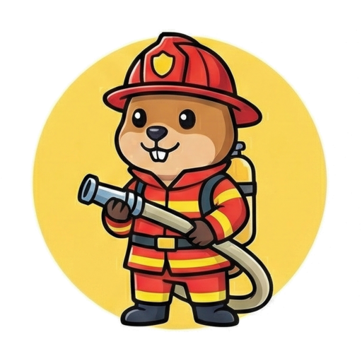

  

# GoSpot - [Live GoSpot](https://gospot-487012134141.us-central1.run.app/)
An online family card game where players need to quickly match images on their cards.

Try it out now on [Live GoSpot](https://gospot-487012134141.us-central1.run.app/)

## How to Play

Welcome to **GoSpot**!  The game is simple, fast, and tons of fun. Here is how you play:

- **The Setup **: Every player starts with the same number of circular cards. One card is placed face-up in the middle of the table—this is the **target card**.
- **The Goal **: Your top card and the target card ALWAYS share exactly **ONE matching symbol**. Your job is to spot it before anyone else!
- **Spot it! **: As soon as you see the matching symbol between your card and the target card, click it as quickly as possible! 
- **Discard & Repeat **: If you're the first to click the right symbol, your top card moves to the middle and becomes the *new* target card for everyone.
- **Winning **: The first player to get rid of all their cards wins the game!

### Special Rules

- **Penalties **: Be careful! If you click on a symbol that *doesn't* match, you'll get a penalty (a red aura will appear around you) and your clicks will be ignored for a couple of seconds.
- **Mega Discard **: When you log in, you choose a special "player symbol" to represent you. If you win a round by matching YOUR player symbol, you get to discard **3 cards** at once instead of just 1!

Gather your friends, start a table, and see who has the fastest eyes!   

